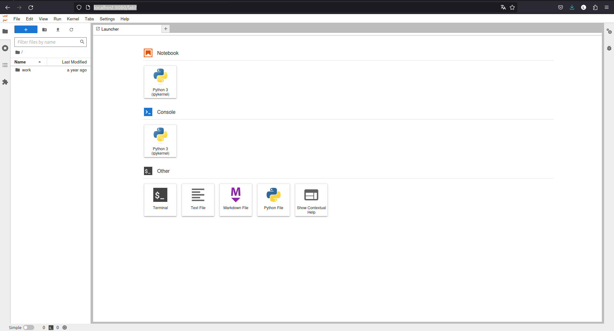
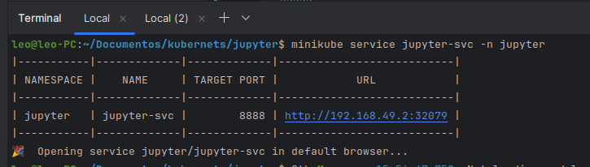
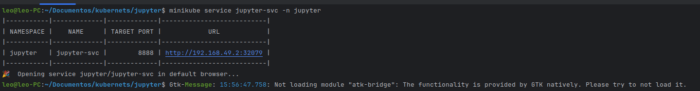
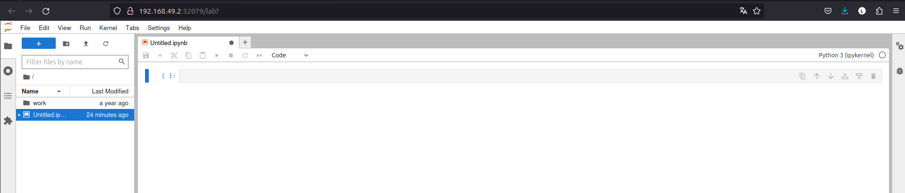
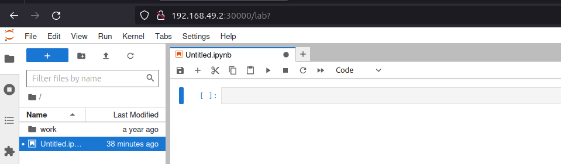
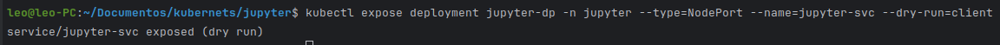

# kubernets
kubernets-jupyter-notbook-application - estudo minikube
##Executando o projeto
### cria o namespace jupyter
```
$ kubectl apply -f /jupyter/jupyter-ns.yml
```
### seta o namespace padrão jupyter
```
$ kubectl config set-context --current --namespace=jupyter
```
### executa o deployment
```
$ kubectl apply -f /jupyter/jupyter-dp.yml
```
### mapeia a porta 8888 do container para acesso externo na porta 8080
```
$ kubectl port-forward jupyter-dp-7db5579d8d-tvmck 8080:8888
```
### Abra algum navegador e acesse localhost:8080, deverá aparecer a aplicação jupyter


### Criando um serviço pela linha de comando do tipo NodePort (namespace não é obrigatório se estiver no namespace correto)
```
$ kubectl expose deployment jupyter-dp -n jupyter --type=NodePort --name=jupyter-svc
```
### O arquivo de criação do serviço acima pode ser visto com o comando "kubectl get svc -o yaml"
```
apiVersion: v1
items:
- apiVersion: v1
  kind: Service
  metadata:
    creationTimestamp: "2024-01-27T18:49:18Z"
    labels:
      app: jupyter-app
    name: jupyter-svc
    namespace: jupyter
    resourceVersion: "1741"
    uid: a3da1a3e-6ef2-4de1-8037-0b7a219e8440
  spec:
    clusterIP: 10.103.235.7
    clusterIPs:
    - 10.103.235.7
    externalTrafficPolicy: Cluster
    internalTrafficPolicy: Cluster
    ipFamilies:
    - IPv4
    ipFamilyPolicy: SingleStack
    ports:
    - nodePort: 32079
      port: 8888
      protocol: TCP
      targetPort: 8888
    selector:
      app: jupyter-pods
    sessionAffinity: None
    type: NodePort
  status:
    loadBalancer: {}
kind: List
metadata:
  resourceVersion: ""
```

## Criando uma url de acesso externo utilizando o minikube
```
$ minikube service jupyter-svc -n jupyter
```




## Migrando a porta de acesso da aplicação
### 1. editar o arquivo de serviço com o nano, setando o nodeport para a porta 30000
```
$ KUBE_EDITOR="nano" kubectl edit service jupyter-svc
```
### Acesso o browser através da url+porta nova http://192.168.49.2:30000


## Mudando a imagem da aplicação jupyter através da linha de comando
```
$ kubectl set image deployment/jupyter-dp jupyter-container=jupyter/minimal-notebook:python-3.10
```


# Dicas
## 1. use o complemento (--dry-run=client) no final do comando para validar o comando, exemplo:
```
$ kubectl expose deployment jupyter-dp -n jupyter --type=NodePort --name=jupyter-svc --dry-run=client
``` 
### Saída:
